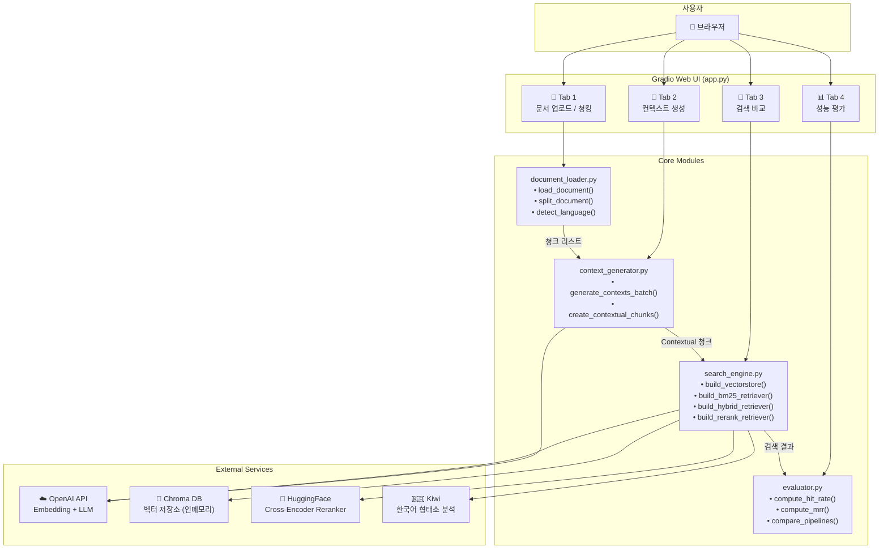
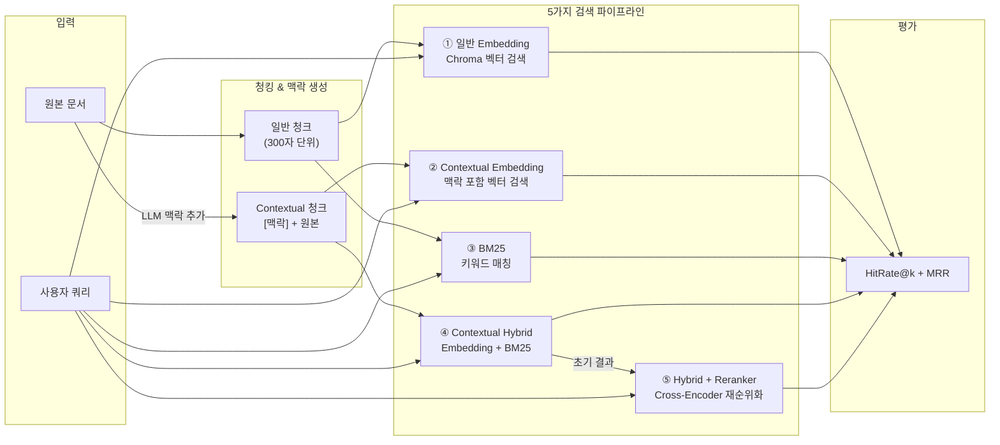

# 🔍 Contextual Retrieval Lab

PRJ02_W1 시리즈 노트북(RAG 평가, 검색 지표, 하이브리드 검색, Rerank, Contextual Retrieval)의 학습 내용을 종합한 **Gradio 기반 RAG 검색 성능 비교 대시보드**입니다.

---

## 이 프로젝트가 하는 일

일반적인 RAG 시스템은 문서를 청크로 분할할 때 **맥락 정보가 손실**됩니다.  
예를 들어 "이 분기의 매출은 8% 증가했습니다"라는 청크만 보면 어떤 회사인지, 언제인지 알 수 없습니다.

**Contextual Retrieval**(Anthropic 제안)은 이 문제를 해결합니다:

```
[기존]  "이 분기의 매출은 전년 동기 대비 8% 증가한 233억 달러를 기록했습니다."

[Contextual]  "[맥락] 테슬라 2023년 3분기 실적 보고서의 매출 성과 부분"
              "이 분기의 매출은 전년 동기 대비 8% 증가한 233억 달러를 기록했습니다."
```

이 앱에서는 이 과정을 직접 실행하고, **5가지 검색 파이프라인**의 성능을 비교할 수 있습니다.

---

## 프로젝트 구조

```
Project-4week_유재혁/
├── app.py                 # Gradio 메인 앱 (엔트리포인트)
├── document_loader.py     # 문서 로드 & 청킹
├── context_generator.py   # LLM 맥락 생성
├── search_engine.py       # 검색 파이프라인 (Embedding, BM25, Hybrid, Reranker)
├── evaluator.py           # 성능 평가 (HitRate, MRR)
├── config.py              # 설정 및 상수
├── requirements.txt       # 의존성
├── .env                   # 환경 변수 (OPENAI_API_KEY)
├── README.md
└── data/                  # 샘플 데이터
    ├── Tesla_KR.md        # 테슬라 한국어 문서
    ├── Rivian_KR.md       # 리비안 한국어 문서
    ├── Tesla_EN.md        # 테슬라 영어 문서
    ├── Rivian_EN.md       # 리비안 영어 문서
    └── testset.xlsx       # 평가용 테스트 쿼리 세트
```

---

## 각 모듈 설명

### 1. `config.py` — 설정

모든 기본값과 환경 변수를 관리합니다.

| 설정 | 기본값 | 설명 |
|------|--------|------|
| `EMBEDDING_MODEL` | `text-embedding-3-small` | OpenAI 임베딩 모델 |
| `LLM_MODEL` | `gpt-4.1-nano` | 맥락 생성용 LLM (가벼운 모델) |
| `DEFAULT_CHUNK_SIZE` | 300 | 청크 분할 크기 (글자 수) |
| `DEFAULT_CHUNK_OVERLAP` | 50 | 청크 간 중복 글자 수 |
| `DEFAULT_TOP_K` | 3 | 검색 결과 상위 k개 |
| `RERANKER_MODEL` | `BAAI/bge-reranker-v2-m3` | Cross-Encoder Reranker 모델 |

### 2. `document_loader.py` — 문서 로드 & 청킹

```
파일 업로드 → load_document() → Document 객체
                                      ↓
                              split_document() → 청크 리스트
```

- `detect_language(text)`: 한국어 문자 비율로 언어 자동 감지 (`"ko"` / `"en"`)
- `load_document(file_path)`: `.md` / `.txt` 파일을 LangChain `Document`로 변환
- `split_document(doc, chunk_size, chunk_overlap)`: `RecursiveCharacterTextSplitter`로 청크 분할

### 3. `context_generator.py` — LLM 맥락 생성

Contextual Retrieval의 핵심 모듈입니다.

```
전체 문서 + 개별 청크 → LLM → 맥락 설명 (50~100자)
                                    ↓
                        "[맥락] {설명}\n\n{원본 청크}"
```

- `generate_context()`: 단일 청크에 대한 맥락 생성
- `generate_contexts_batch()`: 전체 청크를 순차 처리 (오류 시 원본 유지)
- `create_contextual_chunks()`: 맥락 + 원본을 결합한 Contextual 청크 생성

**프롬프트 구조** (Anthropic 스타일):
```
시스템: "문서의 청크에 맥락을 추가하는 전문가입니다..."
사용자: "<document>{전체 문서}</document>
        <chunk>{개별 청크}</chunk>
        맥락 설명:"
```

### 4. `search_engine.py` — 검색 파이프라인

5가지 검색 방식을 구축합니다:

| 파이프라인 | 구성 | 특징 |
|-----------|------|------|
| 일반 Embedding | Chroma 벡터 검색 | 의미 기반 검색 |
| Contextual Embedding | 맥락 추가된 청크로 벡터 검색 | 맥락 정보로 검색 정확도 향상 |
| BM25 | 키워드 기반 검색 | 고유명사, 숫자에 강함 |
| Contextual Hybrid | Embedding + BM25 결합 | 의미 + 키워드 장점 결합 |
| Contextual Hybrid + Reranker | 위 결과를 Cross-Encoder로 재순위화 | 최종 정확도 극대화 |

```
                    ┌─ Embedding 검색 (Chroma)
문서 청크 ──────────┤
                    └─ BM25 검색 (Kiwi/공백 토크나이저)
                              ↓
                    EnsembleRetriever (가중치 조합)
                              ↓
                    CrossEncoderReranker (재순위화)
```

**한국어 처리**: `kiwipiepy` 형태소 분석기로 BM25 토큰화  
**영어 처리**: 공백 기반 토큰화

**Hybrid 가중치 프리셋**:
- Embedding 중심: `0.7 : 0.3`
- 균등: `0.5 : 0.5`
- BM25 중심: `0.3 : 0.7`

### 5. `evaluator.py` — 성능 평가

두 가지 지표로 검색 성능을 측정합니다:

| 지표 | 설명 | 범위 |
|------|------|------|
| **HitRate@k** | 상위 k개 결과 중 정답이 하나라도 포함된 비율 | 0.0 ~ 1.0 |
| **MRR** | 정답이 처음 등장하는 순위의 역수 평균 | 0.0 ~ 1.0 |

**예시**: 정답이 2번째에 있으면 → MRR = 1/2 = 0.5

---

## 전체 데이터 흐름

```
┌──────────────────────────────────────────────────────────────┐
│  Tab 1: 문서 업로드                                           │
│  Tesla_KR.md → load_document() → split_document()            │
│                                    ↓                         │
│                              청크 리스트 (예: 15개)            │
└──────────────────────┬───────────────────────────────────────┘
                       ↓
┌──────────────────────────────────────────────────────────────┐
│  Tab 2: 컨텍스트 생성                                         │
│  각 청크 + 전체 문서 → LLM → 맥락 설명                         │
│                              ↓                               │
│                    Contextual 청크 리스트                      │
│         "[맥락] 테슬라 매출 성과 부분\n\n원본 텍스트"            │
└──────────────────────┬───────────────────────────────────────┘
                       ↓
┌──────────────────────────────────────────────────────────────┐
│  Tab 3: 검색 비교                                             │
│  일반 청크 → Chroma (일반 Embedding)                          │
│  Contextual 청크 → Chroma (Contextual Embedding)             │
│  일반 청크 → BM25                                             │
│  Contextual 청크 → Embedding + BM25 → Hybrid                 │
│  Hybrid → CrossEncoder → Reranker                            │
│                              ↓                               │
│         쿼리 입력 → 5개 파이프라인 결과 비교                     │
└──────────────────────┬───────────────────────────────────────┘
                       ↓
┌──────────────────────────────────────────────────────────────┐
│  Tab 4: 성능 평가                                             │
│  testset.xlsx (질문 + 정답) → 각 파이프라인 평가                │
│                              ↓                               │
│         HitRate@3, MRR 테이블 + 막대 차트                      │
└──────────────────────────────────────────────────────────────┘
```

---

## 실행 방법

### 1. 환경 변수 설정

`.env` 파일에 OpenAI API 키를 입력합니다:

```
OPENAI_API_KEY=sk-your-actual-key-here
```

### 2. 의존성 설치

```bash
pip install -r requirements.txt
```

### 3. 앱 실행

```bash
python app.py
```

브라우저에서 `http://127.0.0.1:7860` 으로 접속합니다.

---

## 사용 순서

> 반드시 Tab 1 → 2 → 3 → 4 순서로 진행해야 합니다.  
> 이전 탭의 결과를 다음 탭에서 사용하기 때문입니다.

### Step 1: 문서 업로드 / 청킹

1. `data/Tesla_KR.md` 같은 파일을 업로드
2. Chunk Size, Overlap 조절 (기본값 권장)
3. "업로드 & 청킹" 클릭 → 청크 목록 확인

### Step 2: 컨텍스트 생성

1. "컨텍스트 생성 시작" 클릭
2. LLM이 각 청크에 맥락 설명을 추가 (API 호출 발생, 시간 소요)
3. 원본 vs 맥락 비교 테이블 확인

### Step 3: 검색 비교

1. Hybrid 가중치 선택 후 "파이프라인 구축" 클릭
2. 쿼리 입력 (예: "테슬라의 2023년 매출은?")
3. "검색" 클릭 → 5개 파이프라인 결과 비교

### Step 4: 성능 평가

1. 테스트셋 업로드 또는 기본 `testset.xlsx` 사용
2. "평가 실행" 클릭
3. HitRate@3, MRR 수치 + 차트 확인

---

## 핵심 개념 정리

### Contextual Retrieval이란?

Anthropic이 제안한 기법으로, 각 청크에 **문서 전체 맥락을 설명하는 텍스트를 추가**하여 검색 성능을 향상시킵니다.

| 기법 | Anthropic 연구 기준 검색 실패율 감소 |
|------|--------------------------------------|
| Contextual Embedding | 35% |
| + Contextual BM25 (Hybrid) | 49% |
| + Reranker | 67% |

### Hybrid 검색이란?

**Embedding 검색** (의미 기반)과 **BM25 검색** (키워드 기반)을 가중치로 결합합니다.

- Embedding: "테슬라 매출 실적" → 의미적으로 유사한 청크 검색
- BM25: "967억 달러" → 정확한 키워드가 포함된 청크 검색
- Hybrid: 두 결과를 합쳐서 더 정확한 결과 도출

### Reranker란?

초기 검색 결과를 **Cross-Encoder 모델**로 다시 평가하여 순위를 재조정합니다.  
쿼리와 문서를 함께 입력받아 관련성 점수를 직접 계산하므로, 단순 벡터 유사도보다 정확합니다.

---

## 테스트셋 형식

`testset.xlsx`는 다음 컬럼을 지원합니다:

| 컬럼명 (우선순위 1) | 컬럼명 (우선순위 2) | 컬럼명 (우선순위 3) | 용도 |
|---------------------|---------------------|---------------------|------|
| `question` | `query` | `user_input` | 검색 쿼리 |
| `ground_truth` | `answer` | `reference` | 정답 텍스트 |

---

## 주요 라이브러리

| 라이브러리 | 용도 |
|-----------|------|
| `gradio` | 웹 UI |
| `langchain` / `langchain-openai` | LLM 체인, 임베딩 |
| `langchain-chroma` | 벡터 저장소 |
| `rank-bm25` | BM25 키워드 검색 |
| `kiwipiepy` | 한국어 형태소 분석 |
| `sentence-transformers` | Cross-Encoder Reranker |
| `matplotlib` | 성능 차트 시각화 |

---

## 시스템 아키텍처



### 검색 파이프라인 상세 아키텍처



---

## 왜 이 기능들이 필요한가

### 기존 RAG의 근본적 문제

일반 RAG는 문서를 300자씩 잘라서 벡터 DB에 넣습니다. 그런데 잘린 청크만 보면 맥락을 알 수 없는 경우가 많습니다.

```
원본 문서: "테슬라 2023년 3분기 실적 보고서 ... (중략) ..."
청크 50:  "이 분기의 매출은 전년 동기 대비 8% 증가한 233억 달러를 기록했습니다."
```

사용자가 "테슬라 매출"을 검색하면 이 청크가 나와야 하는데, 청크 안에 "테슬라"라는 단어가 없을 수 있습니다. 이게 RAG 시스템에서 검색 실패가 발생하는 가장 흔한 원인입니다.

---

## 각 기능의 이점과 활용법

### 1. 문서 로드 & 청킹 — `document_loader.py`

**왜 필요한가**: RAG의 첫 단계. chunk_size가 너무 크면 관련 없는 내용이 섞이고, 너무 작으면 맥락이 손실됩니다.

**이점**: 슬라이더로 chunk_size/overlap을 조절하면서 최적값을 실험할 수 있습니다.

**활용 팁**:
- 보통 200~500자가 적당하고, overlap은 chunk_size의 10~20%가 권장됩니다
- 문서 특성에 따라 다르니 직접 실험해보는 게 중요합니다
- 마크다운 문서는 `\n\n` (단락 구분)을 우선 분할 기준으로 사용합니다

### 2. 컨텍스트 생성 — `context_generator.py`

**왜 필요한가**: 위에서 말한 맥락 손실 문제를 해결하는 핵심 기능. LLM이 "이 청크는 전체 문서에서 어떤 부분인지"를 50~100자로 요약해서 청크 앞에 붙여줍니다.

**이점**: 검색 시 맥락 키워드가 추가되어 있으므로 의미 검색과 키워드 검색 모두에서 정확도가 올라갑니다. Anthropic 연구에서 이것만으로 검색 실패율 35% 감소.

**활용 팁**:
- 실제 서비스에서는 문서가 업데이트될 때마다 컨텍스트를 재생성해야 합니다
- `gpt-4.1-nano` 같은 가벼운 모델을 쓰는 이유가 비용 절감 때문입니다
- 청크가 많을수록 API 호출 비용이 증가하므로, 문서 크기와 비용의 트레이드오프를 고려하세요

### 3. 검색 파이프라인 — `search_engine.py`

이 프로젝트의 핵심입니다. 5가지 검색 방식을 비교할 수 있습니다:

| 검색 방식 | 강점 | 약점 | 적합한 쿼리 |
|-----------|------|------|-------------|
| Embedding | 의미 기반 유사도 | 정확한 숫자/고유명사 약함 | "테슬라 실적이 어때?" |
| BM25 | 정확한 키워드 매칭 | 추상적 질문에 약함 | "967억 달러", "FSD 베타" |
| Hybrid | 두 방식의 장점 결합 | 가중치 튜닝 필요 | "테슬라의 2023년 매출은?" |
| Reranker | 가장 정확한 순위 | 속도가 느림 | 정확도가 최우선인 경우 |

**왜 Hybrid가 중요한가**: 실제 사용자 질문은 의미 기반과 키워드 기반이 섞여 있습니다. "테슬라의 2023년 매출은?"이라는 질문에는 "테슬라 매출"(의미)과 "2023년"(키워드) 모두 중요합니다.

**가중치 실험 활용법**:
- `0.7:0.3` (Embedding 중심): 일반적인 질의응답 챗봇에 적합
- `0.5:0.5` (균등): 범용적으로 무난한 선택
- `0.3:0.7` (BM25 중심): 기술 문서, 법률 문서처럼 정확한 용어 매칭이 중요한 경우

### 4. 한국어 처리 — `kiwipiepy`

**왜 필요한가**: BM25는 단어 단위로 매칭하는데, 한국어는 "테슬라의", "테슬라는", "테슬라가"처럼 조사가 붙습니다. 공백으로 자르면 전부 다른 단어로 인식됩니다.

**이점**: Kiwi 형태소 분석기가 "테슬라 + 의"로 분리해주므로 BM25 정확도가 크게 향상됩니다.

**활용 팁**: 한국어 RAG 시스템에서는 BM25에 형태소 분석기를 붙이는 게 거의 필수입니다.

### 5. 성능 평가 — `evaluator.py`

**왜 필요한가**: "느낌적으로 좋아 보인다"가 아니라 숫자로 비교해야 어떤 파이프라인이 실제로 나은지 판단할 수 있습니다.

**지표 해석**:
- **HitRate@3 = 0.8**: 10번 검색 중 8번은 상위 3개 안에 정답이 있었다
- **MRR = 0.67**: 정답이 평균적으로 1~2위 사이에 위치한다
- **MRR = 0.33**: 정답이 평균적으로 3위 근처에 위치한다

**활용 팁**: 파이프라인을 바꾸거나 파라미터를 조정할 때마다 평가를 돌려서 실제로 개선되었는지 확인하세요.

---

## 실무 활용 시나리오

### 1. RAG 챗봇 구축 전 파이프라인 선택

이 대시보드로 자기 문서에 가장 잘 맞는 검색 방식을 찾고, 그걸 실제 서비스에 적용합니다.

```
내 문서 업로드 → 5가지 파이프라인 비교 → 가장 높은 HitRate 파이프라인 선택 → 서비스에 적용
```

### 2. chunk_size 최적화

같은 문서로 chunk_size를 바꿔가며 평가해보면 최적값을 찾을 수 있습니다.

```
chunk_size=200으로 평가 → chunk_size=300으로 평가 → chunk_size=500으로 평가 → 비교
```

### 3. Hybrid 가중치 튜닝

문서 특성에 따라 Embedding/BM25 비율을 조절합니다.

```
0.7:0.3으로 평가 → 0.5:0.5로 평가 → 0.3:0.7로 평가 → 최적 가중치 선택
```

### 4. Contextual Retrieval 효과 검증

일반 검색 vs Contextual 검색 성능 차이를 직접 확인하고, LLM 비용 대비 효과가 있는지 판단합니다.

```
일반 Embedding HitRate: 0.4  vs  Contextual Embedding HitRate: 0.7
→ 맥락 추가로 75% 향상 → LLM 비용 투자 가치 있음
``
